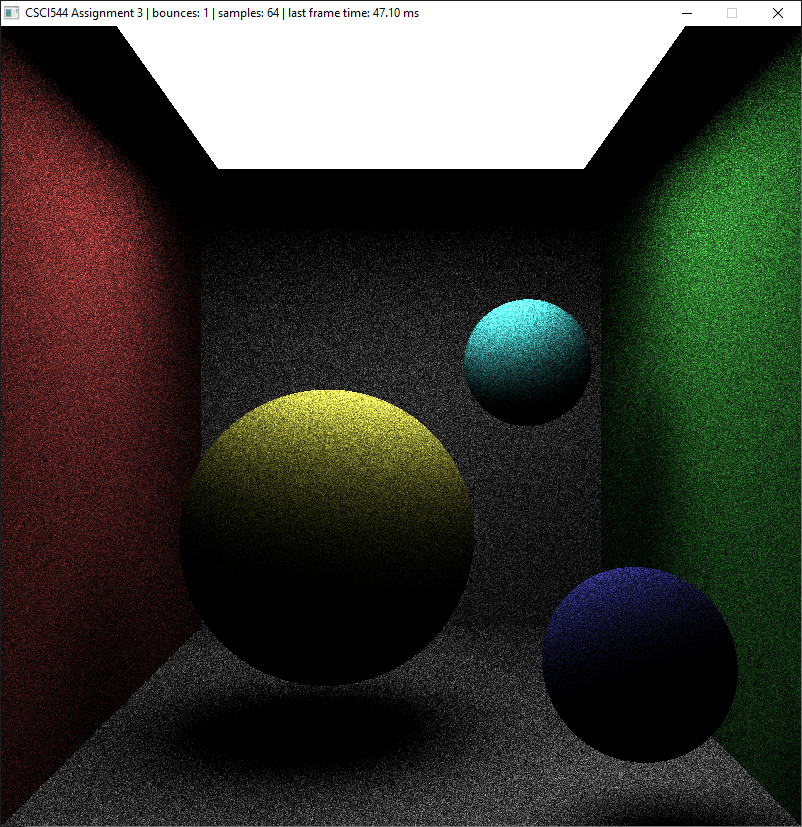
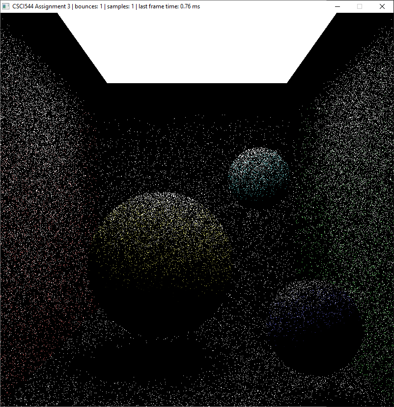

# Simple OpenGL Path Tracer
A simple path tracing implementation using C++ and OpenGL. Renders a simple scene consisting of a Cornell Box with a light source at the top containing three spheres of difference colors. The number of samples and bounces used to render the scene can be varied to investigate their affects on performance and quality.

# Usage
* The `1` and `2` keys can be used to increase and decrease the sample count.
* The `3` and `4` keys can be used to increase and decrease the number of light bounces.
* The `W`, `S`, `A`, `D`, `Z`, and `X` can be used to move the yellow sphere.

# Images

